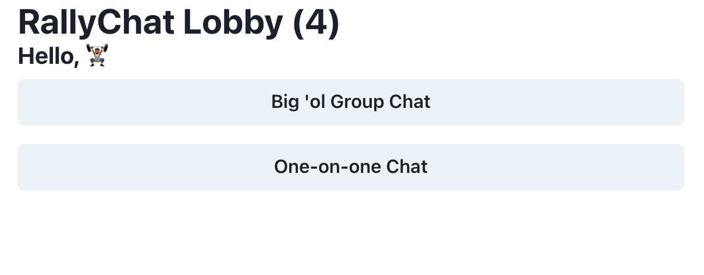
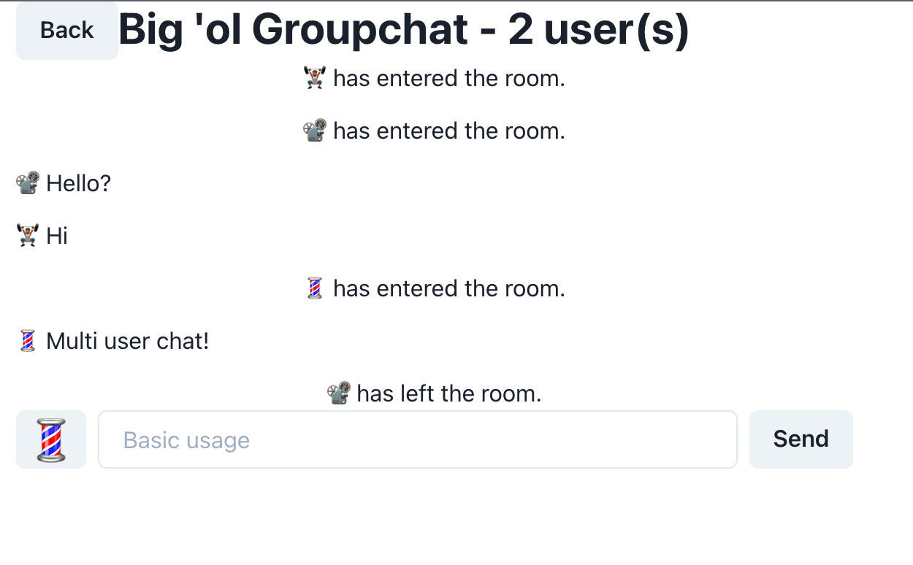

# RallyChat

Currently in early development, RallyChat is a real time application powered by websockets that allows UVM students to anonymously chat either in a large group like YikYak or a random one-on-one pairing like Omegle. The application has been architected so that additional modes may be added with ease. Neither the styling nor architecture is done, but it is fully functional in this state.

|               Lobby               |               Groupchat               |
| :-------------------------------: | :-----------------------------------: |
|  |  |

### Develop locally

1. Clone the resposity.
2. Run `yarn install` in both the root folder and the `UI` folder.
3. Run `yarn build` in both the root folder and the `UI` folder.
4. Run `node index.js` in the newly created `dist` folder (not `UI/dist`)
5. Navigate to `localhost:3000`.
6. Done.
